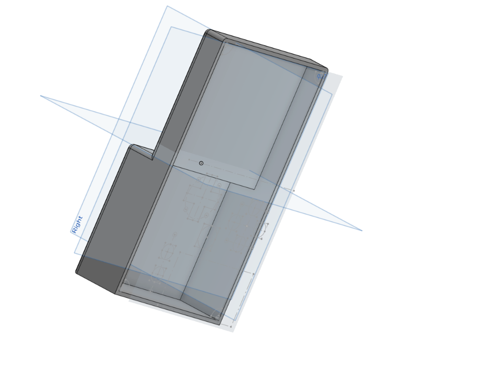
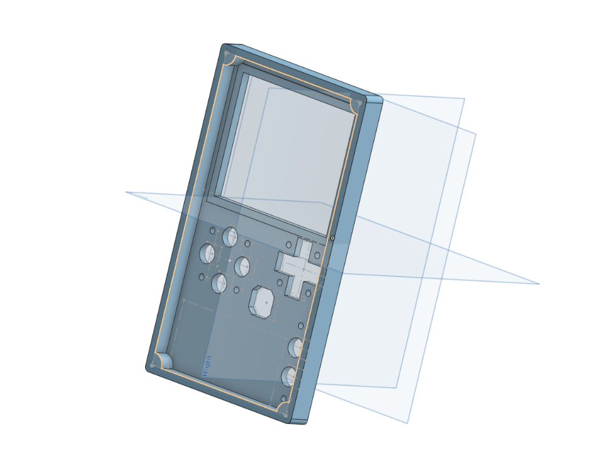
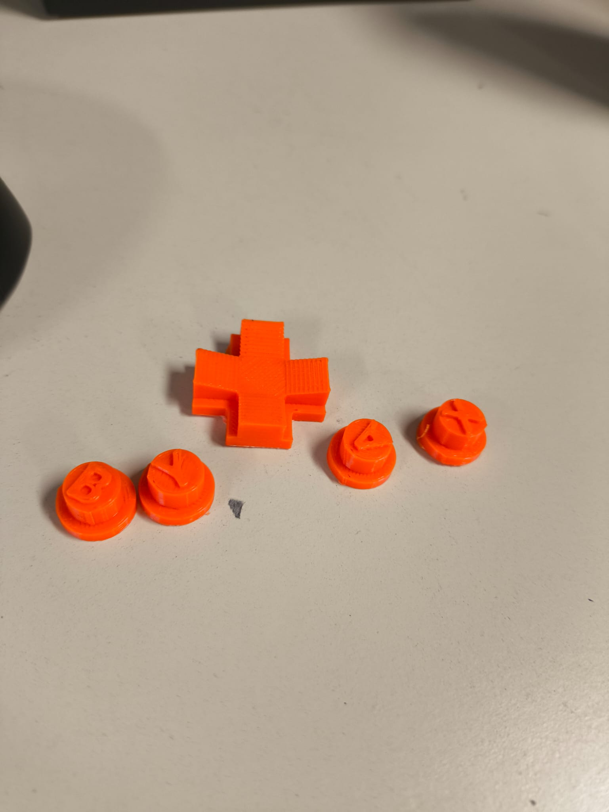
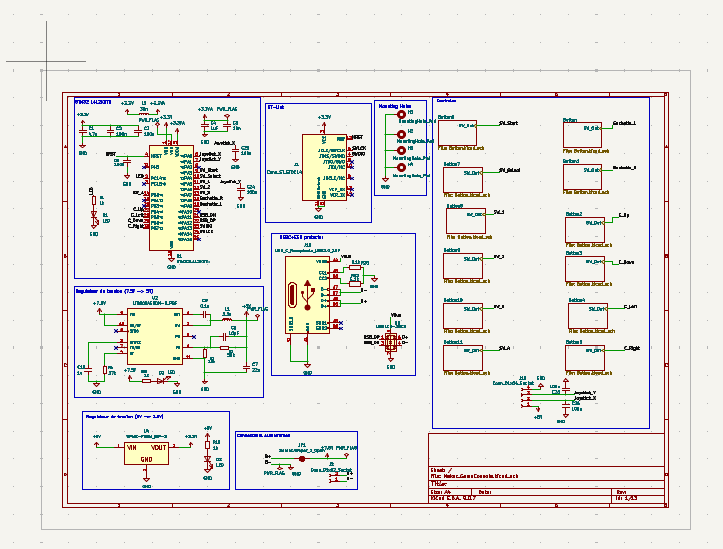
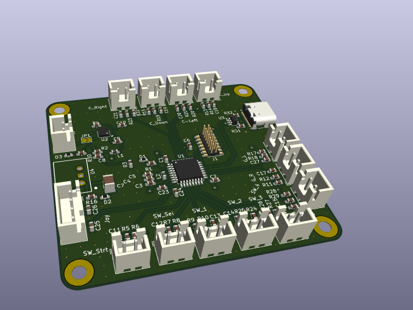

# Avancement sur le Projet Maker

## CAD

Pour le projet, il faut d'abord concevoir le **boîtier** pour accueillir tout les composants. Il y a plusieurs composants à prévoir :

* Raspberry Pi Zero W : qui va servir d'émulateur avec l'aide de l'OS Retropie.
* L'écran : j'ai pris un écran 3.5in qui se pose comme un shield sur les connecteurs de la Raspberry Pi.
* La batterie : 2s2p faites pendant le TD Maker.
* Joysticks, Bouttons...

J'ai réalisé plusieurs prototype sur Onshape pour les imprimere en 3D.

## PCB 

L'idée pour relier les contrôles pour jouer, était de concevoir une "manette" que je relie par USB sur la Raspberry Pi. En effet, l'écran que j'ai acheté avait besoin de tout les connecteurs pour fonctionner donc il n'était pas possible d'utiliser les GPIO de la Raspberry pour les controles.
J'ai réalisé donc un PCB qui fait office de "manette".

## Conclusion

Desolé mais je n'ai pas eu le temps pour faire chose et je n'ai pas reussi a finir la video.
